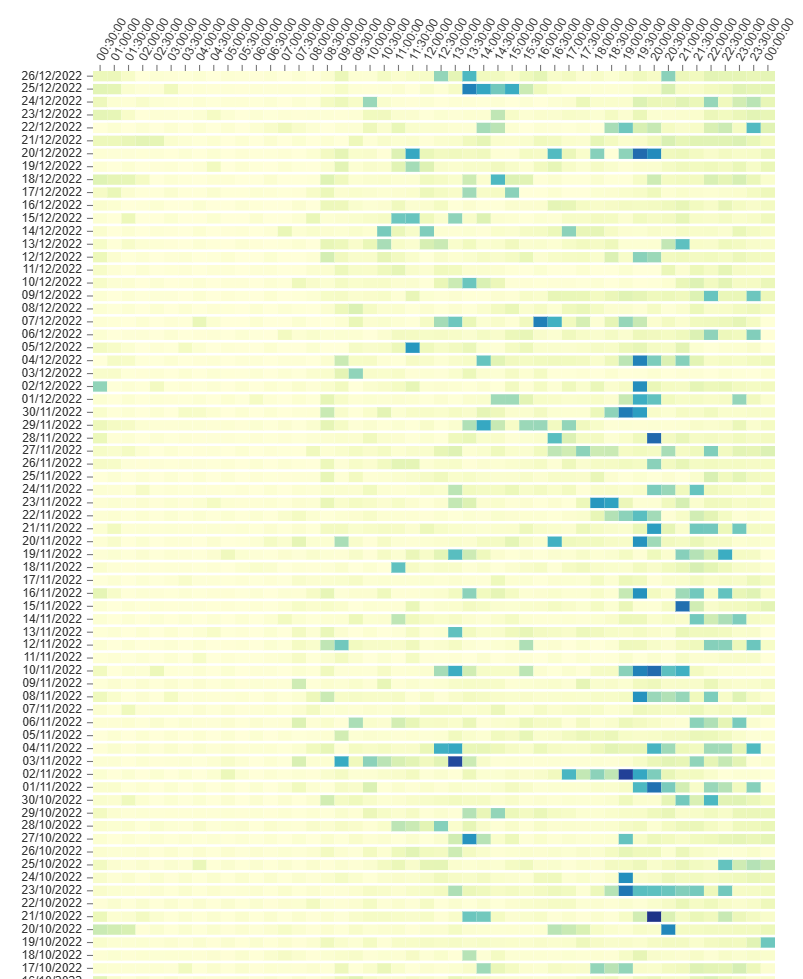

## What it is ?

This app generates a heat map of your electricity usage during the year, assuming data is coming from Electricité de France (EDF).

## Usage

Run the server:

```bash
npm i
npm build
npm start
```

Populate `./data/consommation_electricite.csv` with your 30 minutes data from your EDF user panel.

Go to `http://localhost:3000` on your browser and voilà !



This is a [Next.js](https://nextjs.org/) project bootstrapped with [`create-next-app`](https://github.com/vercel/next.js/tree/canary/packages/create-next-app).